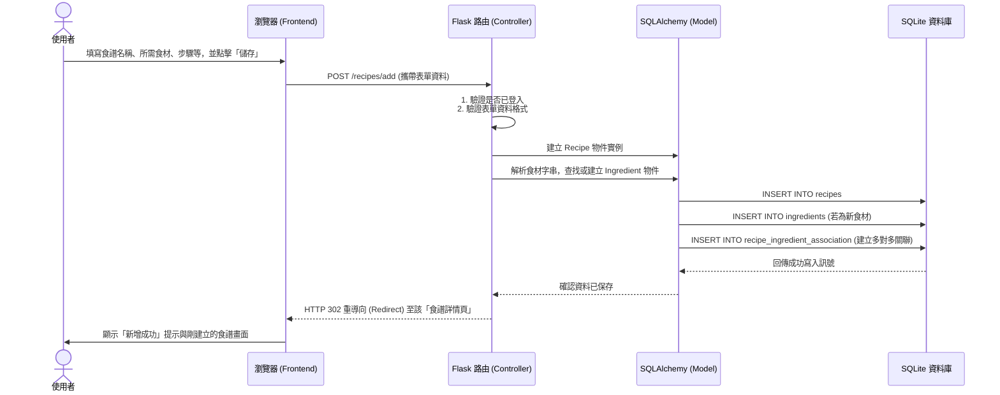

# 流程圖設計 (Flowchart) - 食譜收藏夾系統

本文件基於 PRD 的功能需求與系統架構設計，繪製出「使用者流程圖」與「系統序列圖」，並整理出初步的路由設計清單，確保系統開發前各操作路徑清晰明確。

---

## 1. 使用者流程圖 (User Flow)

此流程圖展示了使用者在網站中可能的操作路徑，包含尚未登入的訪客以及已登入的使用者：

```mermaid
flowchart LR
    A([造訪網站]) --> B{是否已登入？}
    
    %% 未登入流程
    B -->|否| C[瀏覽公開食譜列表]
    C --> C1[使用關鍵字搜尋]
    C --> C2[從食材組合搜尋]
    C --> C3[查看單一食譜詳情]
    C3 -->|欲收藏或建立| GotoLogin[導向登入/註冊頁面]
    
    %% 已登入流程
    B -->|是| D[進入個人首頁 / 總覽]
    D --> E{選擇操作路線}
    
    E -->|找靈感| C
    E -->|我的收藏| F[我的食譜與收藏列表]
    E -->|貢獻食譜| G[填寫新增食譜表單]
    
    F --> F1[使用分類或標籤篩選]
    F --> F2[編輯/刪除自建食譜]
    F --> C3
    
    G --> G1[送出並儲存食譜]
    G1 --> C3
    
    %% 管理員流程 (可選)
    B -->|是 (且為管理員)| H[進入管理員後台]
    H --> H1[管理所有食譜 (可刪除)]
    H --> H2[管理所有使用者]
```

---

## 2. 系統序列圖 (Sequence Diagram)

以下以系統中最核心且具備資料寫入行為的「**新增食譜**」功能為例，展示從使用者操作到資料庫寫入的系統內部運作流程：



---

## 3. 功能清單對照表

根據上述流程，將功能對應到 Flask 的 URL 路徑與 HTTP 方法，作為後續後端開發 (Controller) 的基礎：

| 功能項目 | 說明 | URL 路徑 | HTTP 方法 |
| --- | --- | --- | --- |
| **首頁 / 瀏覽食譜** | 列出最近或熱門的公開食譜 | `/` | GET |
| **關鍵字搜尋** | 依據輸入的字串搜尋食譜標題與介紹 | `/search` | GET |
| **食材組合搜尋** | **(核心)** 依據手邊現有食材交叉比對食譜 | `/search/ingredients` | GET / POST |
| **註冊帳號** | 新使用者建立帳號 | `/auth/register` | GET / POST |
| **登入系統** | 既有使用者登入 | `/auth/login` | GET / POST |
| **登出系統** | 登出並清除 Session | `/auth/logout` | GET |
| **新增食譜** | 填寫表單建立個人食譜 | `/recipes/add` | GET / POST |
| **食譜詳情** | 檢視單筆食譜的完整資訊 | `/recipes/<int:id>` | GET |
| **編輯食譜** | 修改自己發布的食譜 | `/recipes/<int:id>/edit` | GET / POST |
| **刪除食譜** | 刪除自己發布的食譜 | `/recipes/<int:id>/delete` | POST |
| **我的收藏** | 查看使用者儲存或自己建立的食譜列表 | `/my-collection` | GET |
| **後台管理 - 總覽** | 管理員專屬的後台入口 | `/admin` | GET |
| **後台管理 - 食譜** | 管理員檢視/強制刪除食譜 | `/admin/recipes` | GET / POST |
